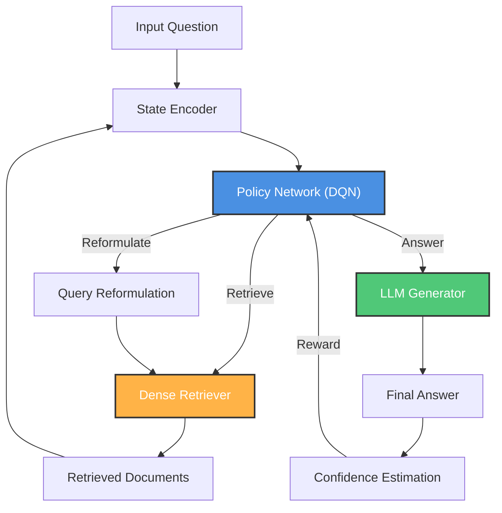

# Adaptive Retrieval-Augmented Generation:<br>Learning When and How Much to Retrieve Across Model Scales

[](https://www.python.org/downloads/)
[](https://opensource.org/licenses/MIT)

A reinforcement learning framework for Retrieval-Augmented Generation (RAG) that learns optimal retrieval policies through Deep Q-Learning. Unlike traditional RAG systems with fixed retrieval strategies, Adaptive RAG dynamically decides when to retrieve more documents, when to reformulate queries, and when to answer—achieving 3.2–6.5% higher accuracy while using 14–37% fewer retrievals.

---

## ✨ Key Features

### Learned Policies via Deep Q-Learning
- Formulates retrieval as a Markov Decision Process (MDP)
- Trains policy network to balance accuracy and efficiency
- No hand-crafted rules—learns from 150K training examples

### Genuine Adaptive Behavior
- High retrieval variance (σ = 0.95–1.52) proves adaptation
- Simple questions: 1.4 retrievals avg
- Hard questions: 3.6 retrievals avg
- Fixed strategies: σ = 0 (zero variance)

### Three-Action Policy
1. **Retrieve**: Fetch top-3 documents via dense retrieval
2. **Reformulate**: Modify query and retrieve with updated query
3. **Answer**: Generate final response and terminate

### Cross-Scale Evaluation
- 7 models: 3.8B → 120B parameters (32× range)
- 199,847 questions from 9 QA datasets
- Evaluates scaling behavior of adaptive retrieval

### Reproducible Work
- Open-source models only (HuggingFace + Groq API)
- Public datasets (SQuAD, HotpotQA, FEVER, etc.)
- Total cost: ~$100
- Detailed protocols for full replication

---

## 🚀 Usage

### Installation

```bash
# Clone repository
git clone https://github.com/JugalGajjar/Adaptive-RAG.git
cd Adaptive-RAG

# Create environment
python -m venv venv
source venv/bin/activate  # Windows: venv\Scripts\activate

# Install dependencies
pip install -r requirements.txt
```

### Prepare Data

#### 1. Download

```bash
mkdir data
cd data

python ../scripts/download_data.py

cd ..
```

#### 2. Build Corpus

```bash
python scripts/clean_data.py

python scripts/build_corpus.py
```

#### 3. Validate Data

```bash
python scripts/validate_data.py
```

#### Data Format (JSONL)

```jsonl
...
{"id": 92915, "question": "who issued the coin rupee for the first time", "answer": "Ancient India", "context": ["The history of the Rupee traces back to the Ancient India in circa 6th century BC .", "Ancient India was the earliest issuers of coins in the world , along with the Chinese wen and Lydian staters ."], "difficulty": "simple"}
{"id": 42032, "question": "Camoflauge consists of what else, in addition to color?", "answer": "shape and pattern", "context": ["One adaptation helping both predators and prey avoid detection is camouflage, a form of crypsis where species have an appearance that helps them blend into the background.", "Camouflage consists of not only color but also shape and pattern.", "The background upon which the organism is seen can be both its environment (e.g., the praying mantis to the right resembling dead leaves) or other organisms (e.g., zebras' stripes blend in with each other in a herd, making it difficult for lions to focus on a single target).", "The more convincing camouflage is, the more likely it is that the organism will go unseen."], "difficulty": "simple"}
...
```

### Write Config

Following the `config/base_config.yaml`, create a config file that will be used to train Adaptive RAG.

### Training

```bash
python -m scripts.train --config-name=config_qwen3_adaptive
```

### Evaluation

```bash
python -m scripts.evaluate --config-name=config_llama8b_adaptive
```

---

## 📖 Methodology

### Problem Formulation

We formulate adaptive retrieval as a **Markov Decision Process** (MDP):

**State** (920-dim): 
- Question embedding (384-dim, SentenceBERT)
- Partial answer embedding (384-dim)
- Document embeddings (128-dim, mean-pooled)
- Scalar features (8-dim): confidence, retrieval count, etc.
- Confidence history (16-dim): last 10 confidence values

**Actions**:
- `retrieve`: Fetch top-3 documents
- `reformulate`: Modify query + retrieve
- `answer`: Generate final response (terminal)

**Reward Function**:

The agent is trained with a multi-component reward that balances accuracy and efficiency:
```python
R_total = (
    5.0 * correctness                     # Correct answer
    + 2.0 * (confidence_gain/retrievals)  # Efficiency reward
    + 2.0 * retrieval_quality             # Document relevance
    - 0.1 * retrievals                    # Retrieval cost
    - 0.05 * steps                        # Step penalty
    + confidence_bonus                    # High confidence bonus
    - over_retrieval_penalty              # Wasteful retrieval penalty
)
```

where:
- **correctness**: 1 if answer matches reference, 0 otherwise
- **confidence_gain**: Final confidence - Initial confidence
- **retrieval_quality**: Semantic similarity between retrieved and relevant documents
- **confidence_bonus**: +1.0 if final confidence > 0.85, +0.5 if > 0.75
- **over_retrieval_penalty**: Penalizes retrieving when already confident

### Training Algorithm

**Deep Q-Learning** with:
- Policy network: 2-layer MLP + 4-head attention
- Experience replay: 50K buffer
- ε-greedy exploration: decay from 1.0 → 0.01
- Confidence-based warm-start: 2K supervised examples
- Training: 3K–5K episodes (local), 2K episodes (API)


### Architecture

```
State (920-dim)
    ↓
Encoder (256-dim)
    ↓
Multi-head Attention (4 heads)
    ↓
Q-values (3 actions)
```

---

## 🔬 System Architecture



---

## 📊 Experimental Setup

### Datasets

9 QA datasets totaling 199,847 questions:

| Dataset | Type | Difficulty |
|---------|------|-----------|
| SQuAD 2.0 | Extractive | Simple |
| Natural QA | Open | Simple |
| TriviaQA | Factoid | Simple |
| HotpotQA | Multi-hop | Medium |
| MuSiQue | Multi-hop | Medium |
| Multi-Hop QA | Multi-hop | Medium |
| StrategyQA | Implicit | Hard |
| FEVER | Fact-check | Hard |
| Climate FEVER | Fact-check | Hard |


**Split**: 150K train / 27K val / 23K test

### Models Evaluated

| Model | Size | Platform |
|-------|------|----------|
| Phi-3.5-mini | 3.8B | A100 GPU |
| Qwen3-4B | 4.0B | A100 GPU |
| Qwen2.5-7B | 7.0B | A100 GPU |
| Llama-3.1-8B | 8.0B | A100 GPU |
| Qwen3-32B | 32B | Groq API |
| Llama-3.3-70B | 70B | Groq API |
| GPT-OSS-120B | 120B | Groq API |

### Baselines

- **Fixed-1**: Always retrieve 1 document
- **Fixed-3**: Always retrieve 3 documents (standard)
- **Fixed-5**: Always retrieve 5 documents (aggressive)
- **Rule-based**: Retrieve until confidence > 0.8 (max 5)

---

## 🎯 Key Results

### Performance Across Model Scales

| Model Size | Accuracy vs Fixed-3 | Retrieval Reduction |
|-----------|-------------------|-------------------|
| **3.8B** (Phi-3.5-mini) | **+5.3%** | **14%** fewer |
| **4B** (Qwen3-4B) | **+6.4%** | **14%** fewer |
| **7B** (Qwen2.5-7B) | **+6.3%** | **22%** fewer |
| **8B** (Llama-3.1-8B) | **+6.5%** | **24%** fewer |
| **32B** (Qwen3-32B) | **+3.5%** | **26%** fewer |
| **70B** (Llama-3.3-70B) | **+4.0%** | **31%** fewer |
| **120B** (GPT-OSS-120B) | **+3.2%** | **37%** fewer |

**Key Insight**: Efficiency gains increase with model scale—larger models benefit more from adaptive retrieval due to stronger parametric knowledge.

### Adaptive Behavior by Question Difficulty

| Difficulty | Avg. Retrievals | Accuracy Gain | Example |
|-----------|----------------|--------------|---------|
| **Simple** | 1.4–1.9 | +2–3% | Single-hop Q&As |
| **Medium** | 2.5–2.8 | +3.8–4.9% | Multi-hop reasoning questions |
| **Hard** | 3.6–4.1 | +2.8–5.1% | Implicit reasoning and fact-checking with conflicting info |

**vs Fixed-3**: Always uses 3 retrievals regardless of difficulty (σ = 0, no adaptation)

---

## 💡 Key Insights

#### 1. Larger Models Need Less Retrieval
- 120B models use 37% fewer retrievals than fixed strategies
- 4B models use only 14% fewer retrievals
- **Why**: Stronger parametric knowledge in larger models

#### 2. Adaptive Retrieval Scales Better
- Accuracy improvements consistent across all scales (3.2–6.5%)
- Efficiency gains increase with model size
- **Why**: Better confidence calibration in larger models

#### 3. Question Difficulty Matters
- Simple: 1.4–1.9 retrievals (50% reduction compared to fixed-3)
- Medium: 2.5–2.8 retrievals (10% reduction compared to fixed-3)
- Hard: 3.6–4.1 retrievals (20% increase compared to fixed-3)
- **Why**: Policy learns to match retrieval to complexity

---

## 📄 License

This project is licensed under the MIT License - see [LICENSE](LICENSE) file.

---

## 🙏 Acknowledgments

- Built with [PyTorch](https://pytorch.org/) and [HuggingFace Transformers](https://huggingface.co/)
- Uses [Groq API](https://groq.com/) for large model inference
- Dataset sources: SQuAD, HotpotQA, FEVER, and others
- Inspired by research on adaptive computation and active retrieval

---

**⭐ Star this repo if you find it useful!**
